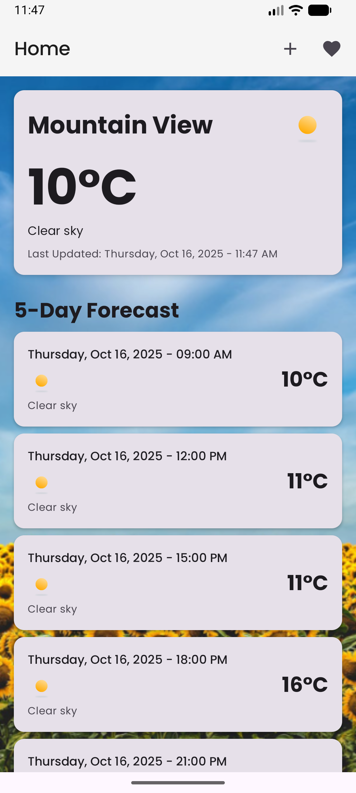
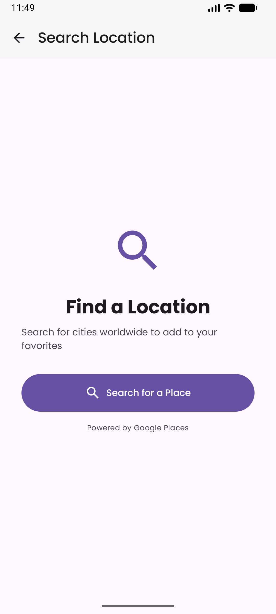
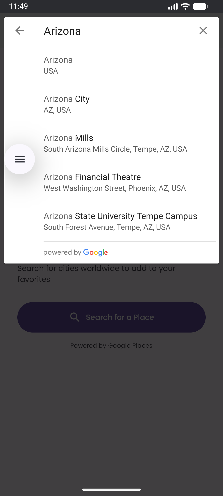
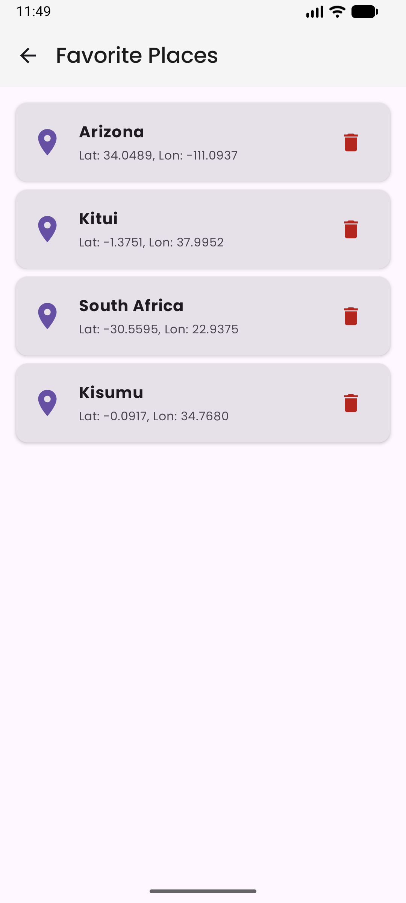
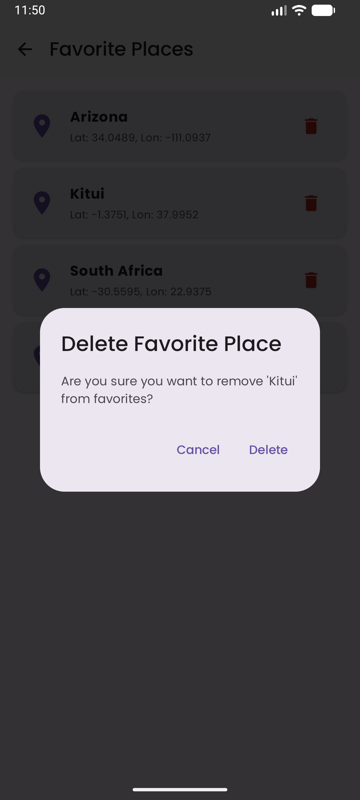
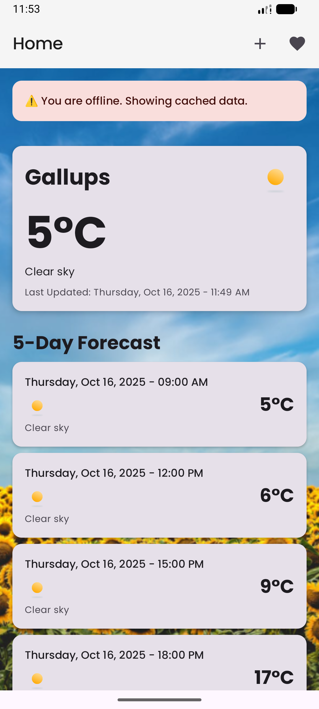

## Weather App

This project uses modularization and MVVM architecture for scalability and maintainability.

## APK
- [Download APK here](https://tsfr.io/join/hz3dyv)

## Architecture Overview

**Modules:**

- **app**: Entry point, navigation, initialization, Koin setup.
- **core**: Shared utilities, constants, base classes, network connectivity service, location services.
- **di**: Dependency injection modules (Koin configuration for Retrofit, Room, Repositories).
- **ui**: Modular presentation layer with MVVM architecture
  - `screens/`: Screen-level composables (Home, Favorites, Place Search, Weather Details)
  - `components/`: Reusable UI components
  - `viewmodel/`: ViewModels for state management (WeatherViewModel, FavoritesViewModel)
  - `state/`: UI state classes
  - `location/`: Location composables and state management
  - `util/`: UI utilities (weather backgrounds, icons)
- **domain**: Business logic, use cases, domain models (independent core layer).
- **data**: Repositories, data sources, API (Retrofit), offline support (Room DB), sync service.

## Tech Stack

**Networking:**
- Retrofit - REST API client
- OkHttp - HTTP client with logging interceptor
- Gson - JSON serialization/deserialization

**Local Database:**
- Room - Offline data persistence (weather cache + favorite places)

**Dependency Injection:**
- Koin - Lightweight DI framework

**Async Operations:**
- Kotlin Coroutines - Asynchronous programming
- Flow - Reactive data streams

**Location Services:**
- Google Play Services Location - Automatic location detection
- FusedLocationProviderClient - Efficient location updates

**Code Quality:**
- KtLint - Code formatting and linting
- KSP - Kotlin Symbol Processing

**UI Framework:**
- Jetpack Compose - Modern declarative UI
- Material3 - Material Design components
- Navigation Compose - Screen navigation

**Typography:**
- [Poppins Font Family](https://fonts.google.com/specimen/Poppins) from Google Fonts - Custom typography with Regular, Medium, and Bold weights for consistent and modern text styling throughout the app

## API Integration

**OpenWeatherMap API:**
- Current Weather: `/data/2.5/weather`
- 5-Day Forecast: `/data/2.5/forecast`
- API Key: Securely stored in `local.properties`

**Google Places API:**
- Place Autocomplete with overlay mode
- Real-time place search with coordinates
- Integrated with favorites management

## Offline-First Architecture

The app implements a robust offline-first strategy:

**Data Flow:**
1. **UI Request** → ViewModel calls Use Case
2. **Immediate Response** → Cached data from Room DB displayed instantly
3. **Background Sync** → API refresh triggered if network available
4. **Auto-Update** → Flow emits new data, UI updates automatically

**Network Monitoring:**
- `NetworkConnectivityService` monitors real-time network status
- `WeatherSyncService` triggers automatic sync when internet becomes available
- Repository checks network before API calls, gracefully handles offline scenarios

**Benefits:**
- ✅ Instant UI updates from local cache
- ✅ Works seamlessly offline
- ✅ Automatic data refresh when online
- ✅ No crashes due to network failures
- ✅ Smooth user experience regardless of connectivity

## Module Dependencies

```
app
 ├─ data
 ├─ domain
 ├─ di → core, data, domain
 ├─ ui
 └─ core

data → domain, core
 ├─ Retrofit (API)
 ├─ Room (Database)
 └─ Network Service

domain (independent)
 ├─ Domain Models
 ├─ Repository Interfaces
 └─ Use Cases

core
 ├─ Location Services
 ├─ Weather Utilities
 └─ Constants
```

## Key Features

✅ Modular architecture for scalability  
✅ MVVM pattern with clear separation of concerns  
✅ Clean Architecture with independent domain layer  
✅ Offline-first with Room database caching  
✅ Real-time network monitoring and auto-sync  
✅ Automatic location detection with runtime permissions  
✅ **Favorite places management with persistent storage**  
✅ **Place search with coordinates-based weather lookup**  
✅ Dynamic weather-based backgrounds and icons  
✅ Reactive UI with Kotlin Flow  
✅ Dependency injection with Koin  
✅ RESTful API integration with Retrofit  
✅ Temperature conversion utilities (Celsius/Fahrenheit)  
✅ Date/time formatting utilities  
✅ Null-safe data models  
✅ Code quality enforcement with KtLint  
✅ Error handling with Result sealed class  
✅ Material Design 3 theming  
✅ Composable location state management
✅ **Comprehensive unit test coverage (TDD)**

## Security & Permissions

**API Security:**
- API keys stored in `local.properties` (not version controlled)
- BuildConfig integration for secure key access

**Required Permissions:**
- `INTERNET` - Network access for API calls
- `ACCESS_NETWORK_STATE` - Monitor network connectivity
- `ACCESS_FINE_LOCATION` - Precise location for accurate weather
- `ACCESS_COARSE_LOCATION` - Approximate location as fallback

## Development Setup
1. Clone the repository
2. Create `local.properties` file in the root directory
3. Add the following API keys from **Github Secrets** of this repository:
   ```
   WEATHER_API_KEY=your_openweather_api_key_here
   PLACES_API_KEY=your_google_places_api_key_here
   ```
4. Update `WeatherApplication.kt` in **app** module with API keys:
   ```kotlin
   Constants.API_KEY = BuildConfig.WEATHER_API_KEY
   Constants.PLACES_API_KEY = BuildConfig.PLACES_API_KEY
   ```
5. Sync Gradle dependencies
6. Run the app
7. Grant location permission when prompted

**Getting API Keys:**
- **OpenWeatherMap**: Sign up at [openweathermap.org](https://openweathermap.org/api)
- **Google Places**: Enable Places API in [Google Cloud Console](https://console.cloud.google.com/)

## UI Components
- **Screens:** Home, Favorites, Place Search, Weather Details
- **Reusable Components:** Weather cards, forecast items, offline/error messages
- **ViewModels:** WeatherViewModel, FavoritesViewModel
- **State Classes:** UI state representations
- **Location Composable:** Location permission and fetching

## Code Quality

Run code formatting:
```bash
./gradlew ktlintFormat
```

Check code style:
```bash
./gradlew ktlintCheck
```

## Testing

The project includes comprehensive unit test coverage across all layers:

**Domain Layer Tests:**
- `GetCurrentWeatherUseCaseTest` - Weather fetching logic
- `GetForecastUseCaseTest` - Forecast fetching logic  
- `FavouritesPlacesUseCaseTest` - Favorites management logic
- `CurrentWeatherTest` - Domain model validation
- `ForecastTest` - Domain model validation
- `FavoritePlaceTest` - Domain model validation

**Data Layer Tests:**
- `FavoritePlaceRepositoryImplTest` - Repository implementation and mapping
- `FavoritePlaceEntityTest` - Entity model validation
- `CurrentWeatherEntityTest` - Entity model validation
- `ForecastEntityTest` - Entity model validation
- `WeatherRepositoryImplTest` - Weather repository implementation

**UI Layer Tests:**
- `WeatherViewModelTest` - Weather state management
- `FavoritesViewModelTest` - Favorites state management
- `WeatherUiStateTest` - UI state validation
- `WeatherUtilTest` - Weather utility functions

**Run all tests:**
```bash
./gradlew test
```

**Run tests with coverage:**
```bash
./gradlew testDebugUnitTest
```

**Test Coverage Summary:**
- ✅ **65+ Unit Tests** covering business logic, data mapping, and UI state
- ✅ **TDD Approach** with MockK for mocking
- ✅ **Coroutine Testing** using kotlinx-coroutines-test
- ✅ **Flow Testing** with proper collection
- ✅ **Edge Cases** including null handling, empty states, and error scenarios

## Recording & screenshots
- **Recording:** [Demo Video](screenshots_recording/weather_app_demo.mp4)

<p align="start">
    <video src="[https://github.com/Dynamic-Visual-Technologies-PTY-LTD/mob-android-weather-app-full-assessment-starter-project-defed850-18a3-41f5-8e78-d077d715e2ec/blob/main/screenshots_recording/weather_app_demo.mp4]" width="300" controls></video>
</p>

- **Screenshots:**

<p align="start">
    
    
</p>

<p align="start">
    
    
</p>

<p align="start">
    
    
</p>
